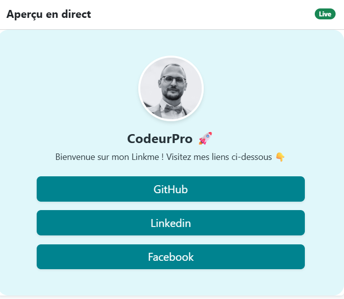
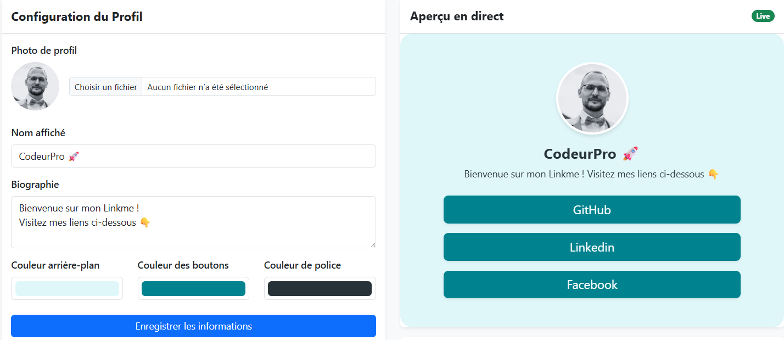

# 🔗 Link Me


> **Link Me** est une plateforme permettant aux utilisateurs de créer une page "vitrine" regroupant tous leurs liens importants (Instagram, TikTok, Portfolio, etc.) en un seul endroit.

Ce projet a été réalisé dans le cadre d'un exercice de formation.

---

## 📸 Aperçu

### Rendu de la page publique


### Exemple de personnalisation



### Espace d'administration



---

## ✨ Fonctionnalités

- [x] **Système d'authentification** : Inscription et connexion sécurisées (`password_hash`).
- [x] **Panel d'administration** : Interface pour gérer son "Link Tree".
- [x] **CRUD Complet** : Ajouter, modifier et supprimer des liens de redirection
- [x] **Personnalisation** : Choix des couleurs (fond, boutons, texte) pour une page unique, ajout/modif d'une image de profil
- [x] **Responsive** : Interface adaptée aux mobiles et tablettes.
- [x] **Gestion des erreurs** : Importation des erreurs dans logs/error_log.txt avec date, message d'erreur et code d'erreur.

---

## 🛠️ Stack Technique

- **Langage** : PHP Natif (Pas de framework)
- **Base de données** : MySQL
- **Frontend** : Bootstrap 5, CSS3
- **Architecture** : Routeur simple (public/index.php) -> inclusion d'une vue selon la dynamique de l'URL

---

## 🚀 Installation et Configuration

Pour tester le projet localement, suivez ces étapes :

### 1. Récupérer le projet

Ouvrez votre terminal dans votre dossier serveur (`htdocs` ou `www`) :

```bash
git clone [https://github.com/KevinUrbain/link-me.git](https://github.com/KevinUrbain/link-me.git)
```

### 2. Base de données

- Ouvrez votre gestionnaire SQL (phpMyAdmin, DBeaver...).
- Créez une base de données nommée mylink_in_bio.
- Importez le fichier mylink_in_bio.sql fourni à la racine du projet

## 👤 Auteur

Kevin Urbain - [Voir mon profil GitHub](https://github.com/KevinUrbain)
